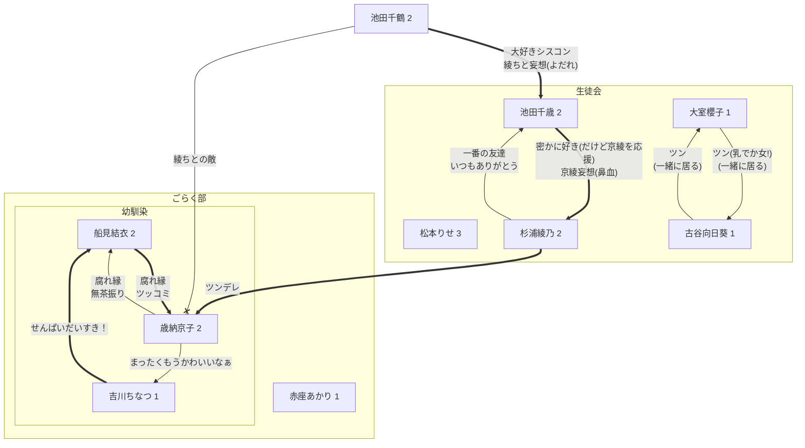

# ゆるゆり主要キャラクター相関図

> 太線は恋愛感情

 主人公はごらく部の赤座あかり 

```mermaid
flowchart TD
    subgraph goraku[ごらく部]
        direction TB
        subgraph osana[幼馴染]
          yui[船見結衣 2]
          kyouko[歳納京子 2]
          chinatsu[吉川ちなつ 1]
        end
        akari[赤座あかり 1]
    end

    subgraph seitokai[生徒会]
        direction TB
        rise[松本りせ 3]
        chitose[池田千歳 2]
        ayano[杉浦綾乃 2]
        sakurako[大室櫻子 1]
        himawari[古谷向日葵 1]
    end

    chizuru[池田千鶴 2]


yui == 腐れ縁\nツッコミ ==> kyouko
kyouko -- 腐れ縁\n無茶振り --> yui
chinatsu == せんぱいだいすき！ ==> yui
chizuru == 大好きシスコン\n綾ちと妄想(よだれ) ==> chitose
ayano == ツンデレ ==> kyouko
sakurako -- ツン(乳でか女!)\n(一緒に居る) --> himawari
himawari -- ツン\n(一緒に居る) --> sakurako
chitose == 密かに好き(だけど京綾を応援)\n京綾妄想(鼻血) ==> ayano
kyouko -- まったくもうかわいいなぁ --> chinatsu
chizuru -- 綾ちとの敵 --x kyouko
ayano -- 一番の友達\nいつもありがとう --> chitose
```
